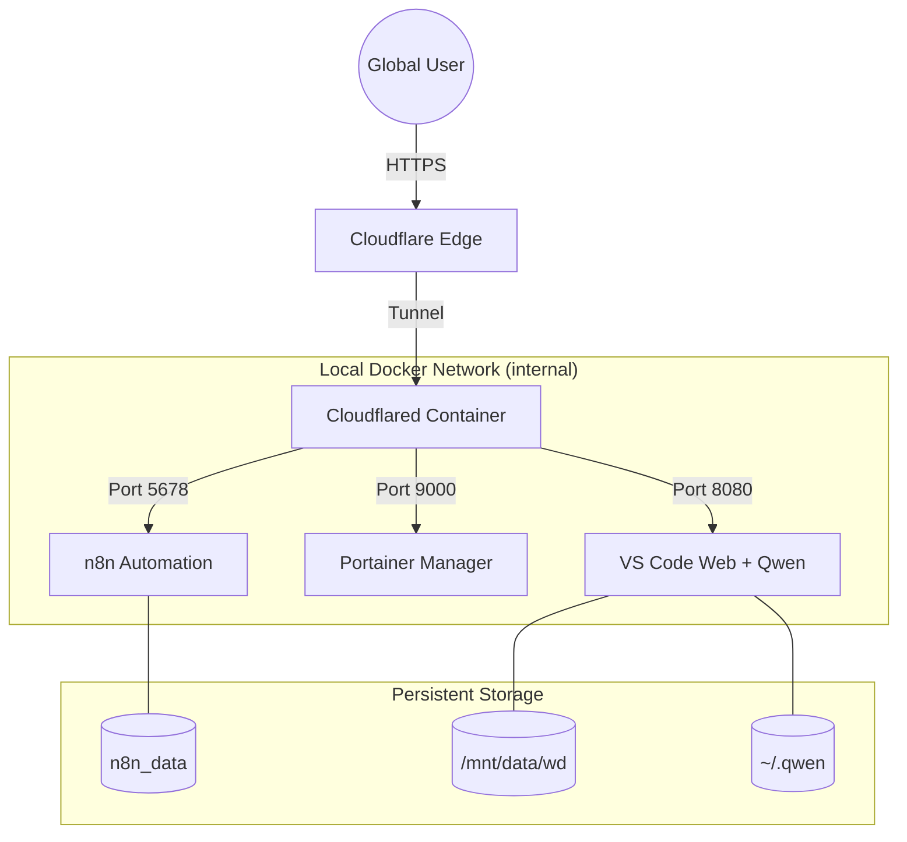

# Home Automation & Remote Dev Stack

This project provides a secure, industrial-grade remote automation and development environment hosted on a local machine, made accessible over the internet via **Cloudflare Tunnels**.

## 🚀 The Core Idea

The goal is to have a **"Remote Home Base"** that allows you to manage automations and write code using AI (`qwen`), from any device in the world, without exposing your home IP address or opening any router ports.

### Why this setup?
- **Zero Port Forwarding**: Uses `cloudflared` to create a secure outbound-only connection.
- **Custom Branding**: Every service is accessed via your own domain (`mahathasan.com`).
- **Unified Management**: Everything runs in Docker containers for easy backup and scaling.

---

## 🏗️ Architecture



---

## 🛠️ Included Services

| Subdomain | Service | Purpose |
| :--- | :--- | :--- |
| **n8n.mahathasan.com** | **n8n** | The "Brain": Handles all B2B email automations, Facebook bots, and custom workflows. |
| **portainer.mahathasan.com** | **Portainer** | The "Engine Room": A visual dashboard to monitor and manage all Docker containers. |
| **qwen.mahathasan.com** | **Code-Server** | The "Workshop": A full VS Code editor in your browser. Pre-configured with the **Qwen Code CLI** for AI-assisted coding on your actual project files. |

---

## 🔒 Security Summary

- **SSL/TLS**: All traffic is encrypted via Cloudflare certificates.
- **Authentication**:
    - **n8n**: User-managed login.
    - **Portainer**: Admin account password.
    - **Code-Server**: Password protected (`qwen2024` by default).
- **Hardening**: It is recommended to enable **Cloudflare Access** (Zero Trust) to add an identity-based login gate (e.g., Google login or One-Time PIN) in front of these subdomains.

---

## 📂 Project Structure

```text
/mnt/data/wd/Automation/
├── cloudflared/
│   ├── config.yml           # Tunnel routing rules
│   ├── cert.pem             # Cloudflare authorization
│   └── *.json               # Tunnel credentials
├── docker-compose.yml       # Entire stack definition
├── Dockerfile.code-server   # Custom VS Code build with Node.js support
└── README.md                # This document
```

---

## 🚀 Maintenance Commands

### Start Everything
```bash
docker compose up -d
```

### Update the AI Editor (Code-Server)
If you change the Dockerfile or need to refresh the Node.js environment:
```bash
docker compose build code-server
docker compose up -d --force-recreate code-server
```

### View Logs
```bash
docker compose logs -f [service_name]
```

---

## 📖 Related Documentation
- [Tunnel Recovery Guide](file:///mnt/data/wd/Automation/cloudflared/tunnel_recovery_guide.md): How to fix the tunnel if it goes down.
- [Cloudflare Onboarding](file:///mnt/data/wd/Automation/cloudflared/tunnel_guide.md): How the domain was connected.
