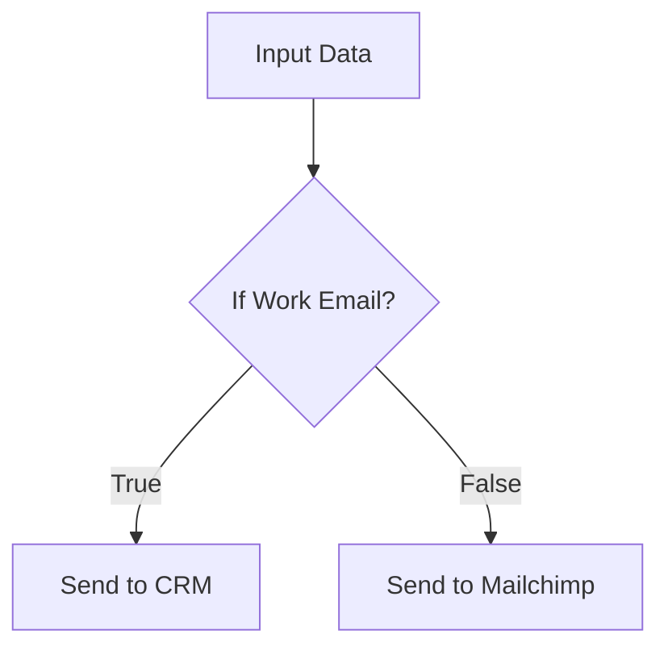

# Core Workflow Concepts & Branching

This guide covers the structural elements of n8n—from the canvas layout to complex logic branching.

## The n8n Canvas
- **Workflow Menu:** Manage name, tags, and ownership.
- **Activation:** The "Production" switch. When **Active**, the workflow runs automatically based on triggers.
- **Executions:** A history of every time the workflow ran (Successful or Failed).

---

## Triggers: Starting the Flow
Triggers have an **orange lightning icon** and **no input branches**.
- A workflow can have multiple triggers (e.g., run on a Schedule AND via Webhook).
- **Pro Tip:** In the canvas, you can double-click a node to see its predecessors and successors for easy navigation.

---

## Branching: Diversifying the Path

### 1. Conditional Branching (Split)
Use nodes like **If** or **Switch** to send specific items down different paths based on data.
- **Behavior:** Each item follows **only one** path.
- **Example:** Professional emails go to "Path A", personal emails go to "Path B".

### 2. Parallel Branching (Duplicate)
Created by dragging multiple lines out of a single node's output.
- **Behavior:** **Every item** is duplicated and sent down **every path**.
- **Use Case:** You want to save data to a database AND send a Slack alert at the same time.

---

## Example: Complex Logic in an "If" Node
You can combine multiple criteria using **AND** or **OR** logic:
- **AND:** All conditions must be met (e.g., "Email exists" AND "Email is not Gmail").
- **OR:** At least one condition must be met (e.g., "Email is Gmail" OR "Email is Hotmail").

---

## Production vs. Testing
- **Test Workflow:** Executing manually in the canvas. Uses "Test" credentials and URLs.
- **Production:** Toggling the "Active" switch. Once active, it runs silently in the background.
