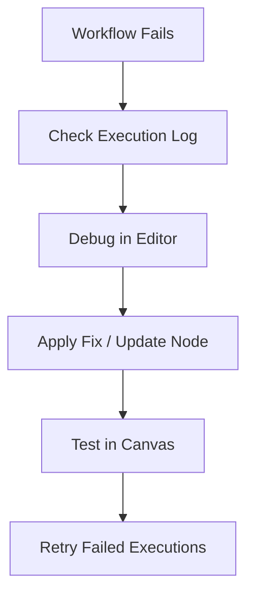

# Debugging Workflows in n8n

Debugging is the process of identifying, understanding, and fixing errors to ensure your automations run smoothly in production.

## Why Do Workflows Fail?
- **Configuration Errors:** Incorrect node settings or mapping.
- **Service Unavailability:** External APIs (like Google Sheets or Slack) returning 5xx errors.
- **Data Issues:** Missing information in a Webhook or unexpected data formats.

---

## The Debugging Toolkit

### 1. Debug in Editor
The most powerful tool in n8n. It allows you to "pin" data from a failed execution history directly into your workflow canvas.
- **Blue/Purple Icon:** Indicates pinned data.
- **Benefit:** You can troubleshoot the exact data that caused the failure without re-triggering the external service.

### 2. Retry Feature
Once a fix is implemented, you can retry executions from the **Execution Log**.
- **Retry with Original Workflow:** Runs the data through the version of the workflow that existed at the time of the error.
- **Retry with Current Workflow:** Runs the data through your newly fixed logic.
- **Execution Point:** Retries start from the node that failed, saving time on successful preceding steps.

### 3. Edit Output
Manually modify the output of a node during testing. 
- *Use sparingly:* It's great for quick tests but doesn't scale for production fixes.

### 4. Version History
If your debugging attempts create new issues, use the **Version History** (top right) to revert to a previous working state.

---

## Summary of Debugging Flow

---

## Pro Tip: "Silent" Failures
Sometimes a workflow doesn't "fail" with an error but doesn't perform the task (e.g., a filter blocked something incorrectly).
- Always use **Executions** to inspect the path items took.
- Set nodes to **"Always Output Data"** in settings to see what happened even when no results were found.
