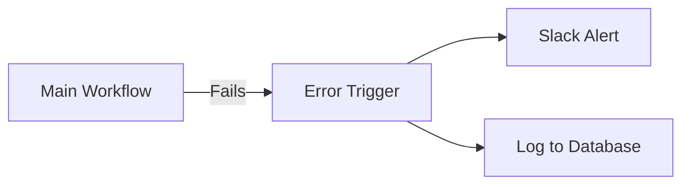

# Error Handling & Debugging

Automations are rarely "set and forget." Errors happen due to API outages, invalid data, or configuration mistakes. Mastery of n8n requires knowing how to catch and fix these issues.

## 1. Monitoring Executions
- **Execution Log:** Access "All Executions" to see the history.
- **Production vs. Manual:** By default, n8n saves **production** (active) executions but not manual tests.
- **Snapshots:** Past executions are **static snapshots**. You can't change them, but you can inspect every node's input and output at that specific moment.

---

## 2. The Error Workflow (Essential)
An **Error Workflow** is a separate workflow that triggers automatically when another workflow fails.
- **Trigger:** Use the **Error Trigger** node.
- **Reporting:** Send alerts to Slack, Discord, or Email with the execution URL and error message.

---

## 3. Handling Specific Errors within a Workflow

### Stop and Error Node
Manually raise an error when a condition is met (e.g., an invalid email format). This allows you to stop the flow before it causes data issues.

### Node Settings: "On Error"
Every node can be configured to:
- **Stop Workflow (Default):** The entire execution is marked as "Failed."
- **Continue:** Ignore the error and proceed to the next node.
- **Continue with Error Output:** The node gains an extra output for errors.

---

## 4. Debugging Techniques

### Debug in Editor / Copy to Editor
- **Debug in Editor:** Pins the exact data from a failed execution into your current canvas. Use this to re-run the logic with the "broken" data and find the fix.
- **Copy to Editor:** Similar, but used for successful (yet logically wrong) executions.

### Retry Feature
- After fixing a bug, you can **retry** failed executions directly from the log.
- **Re-execute from Errored Node:** Saves time by not repeating successful previous steps.

---

## 5. Version History
Mistakes happen during debugging! Use the **Version History** (top right) to revert to a previous working structure if your "fixes" make things worse.
