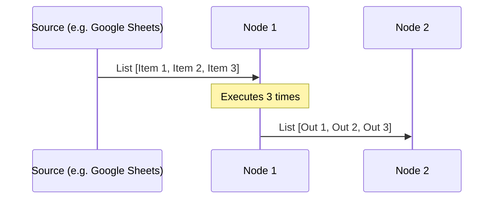

# How n8n Handles Data

Understanding n8n's data structure is crucial for building complex workflows. n8n primarily uses **Items**, which are individual JSON objects within a list.

## Core Data Structures

### 1. JSON (JavaScript Object Notation)
JSON is a collection of **Key-Value pairs** written inside curly braces `{}`.
- **Example:** `{"first_name": "Emily", "last_name": "Johnson"}`

### 2. Lists (Arrays)
A collection of items (often JSON objects) written inside square brackets `[]`.
- **Relationship:** **1 JSON Object = 1 Table Row**. A list of JSON objects is equivalent to a full table.

---

## The "Item" Concept
In n8n, an **Item** is the individual unit of work. 
- **Execution Rule:** Most nodes execute **once per item** in the input data.
- **Exception:** You can set a node to "Execute Once" in settings if you only want it to process the first item.

### Execution Schema


---

## Expressions & Data Access

### Dot Notation
Access values using a path: `{{ $json.key }}`.
- **Embedded JSON:** To access a nested value: `{{ $json.location.city }}`.

### The Expression Editor
Everything inside `{{ }}` is an **Expression**. Expressions can include:
1.  **Item Variables:** Data from the previous node.
2.  **JavaScript:** Apply methods like `.toUpperCase()` or `.split()`.
3.  **Combination:** Mix plain text with variables: `Hello {{ $json.first_name }}!`

### Example: Full Name Mapping
To create a `full_name` field from `first_name` and `last_name`:
```javascript
{{ $json.first_name }} {{ $json.last_name.toUpperCase() }}
```
*(Result: "Emily JOHNSON")*

---

## Key Takeaway
If your workflow isn't behaving as expected, check if you are dealing with a **list of items** versus a **single item**. Most issues stem from misunderstanding how many times a node is executing based on its input.
