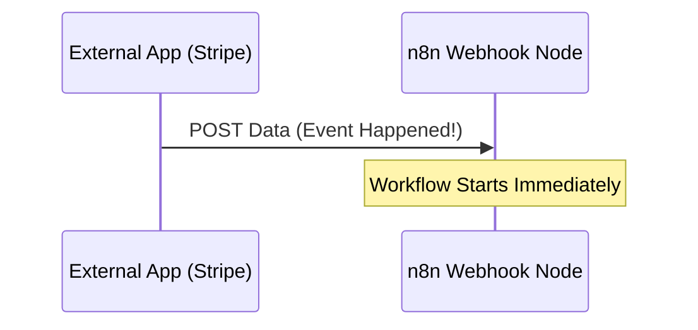

# Introduction to APIs and Webhooks

APIs and Webhooks are the "waiters" and "doorbells" of the digital world, allowing n8n to communicate with other services.

## What is an API?
> **Analogy:** Sitting at a restaurant. You (the **Client**) tell the Waiter (the **Interface**) your order. The waiter takes it to the Kitchen (the **Application/Server**), which prepares your food. The waiter then brings it back.

- **Abstraction:** The API hides the complexity of the server. You don't need to know how the "kitchen" works; you just need to follow the **Menu** (**Documentation**).

### Components of an HTTP Request
1.  **URL:** The unique location of the resource (e.g., `https://api.example.com/data`).
2.  **Method:** The "verb" describing the action:
    - `GET`: Retrieve data (e.g., read a sheet).
    - `POST`: Send data (e.g., submit a form).
    - `PUT/PATCH/DELETE`: Update or remove data.
3.  **Headers:** Extra context (e.g., "I accept JSON format" or "I am browsing from a phone").
4.  **Body:** The actual data being sent (used in `POST`, `PUT`, etc.).

### Authentication (Credentials)
Credentials prove you are authorized to access the data. 
- **API Key:** A secret token sent in the Header or URL.
- **OAuth2:** The "Sign in with Google" flow—secure and standard.

---

## Response Status Codes
When a server answers, it sends a 3-digit status code:
- **2xx (Success):** Everything is OK (e.g., `200 OK`).
- **4xx (Client Error):** You made a mistake (e.g., `401 Unauthorized` or `404 Not Found`).
- **5xx (Server Error):** The server is broken; try again later.

---

## What is a Webhook? (The "Reverse API")
> **Analogy:** Polling is like checking the door every 5 minutes to see if friends arrived. A Webhook is the **doorbell**—you wait for it to ring.

- **Sync/Async:** Webhooks trigger your workflow *instantly* when an event happens in an external app (e.g., a new Stripe payment).
- **Setup:** You provide a **URL** to the external service, and they "push" data to it.

