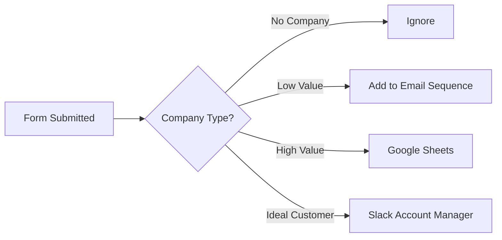

# Introduction to Automation with n8n

Automation is the key to transitioning from subjective, "feeling-based" decisions to objective, data-driven logic. It reduces human error, increases efficiency, and improves employee happiness by removing repetitive low-value tasks.

## Why Automate?

| Manual Tasks | Automated Tasks |
| :--- | :--- |
| High human error | Predictability & Data Availability |
| Wasted time on low-value tasks | Increased Efficiency & High-Value Focus |
| Low employee retention/happiness | Higher ROI & Reduced Resource Needs |
| Subjective & hard to measure | Objective & Transparent Visibility |

---

## What is Automation?
> **Definition:** A predictable set of predetermined actions that transfers data from one point to another.

### Example: Form Submission Workflow
When a form is submitted, the system evaluates the company type and routes data accordingly:

---

## Core Concepts

### 1. The Trigger
The "start" of every automation. 
- **Manual:** Executed by clicking a button.
- **Scheduled:** Recurring (e.g., every day at 8 AM).
- **Event-based:** Triggered by apps (e.g., Webhook, CRM update, Form submission).
- *Visual Cue:* Triggers have outgoing arrows but no incoming arrows.

### 2. Filtering & Transformation
Allows you to block or route data based on conditions.
- **Example:** If "Company" field is empty, stop the workflow.
- **Transformations:** Changing data formats (e.g., "Change this to that").

### 3. Actions (Apps)
Interacting with web applications to perform tasks.
- **Google Sheets:** Create/Update rows.
- **Slack:** Send messages.
- **Dropbox:** Upload files.
- **Salesforce:** Create leads.

---

## Best Practices: Mapping Your Workflow
**CRITICAL:** Always map out your process *before* building it.

1. **Understand the Task:** Is it predictable?
2. **Check Feasibility:** Are the necessary app actions available?
3. **Estimate Workload:** How complex is the build?
4. **Identify Human Intervention:** Where is human judgment still required? (Note: AI can often bridge these gaps).

### How to Map
1. **Tooling:** Use Miro, FigJam, or any flowchart tool.
2. **Blocks:** List every step as an individual block.
3. **Arrows:** Connect blocks from left to right to show data flow.
