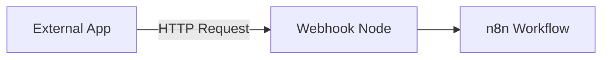

# Useful Nodes in n8n (Cheat Sheet)

A guide to the most common nodes used for data manipulation, aggregation, and triggering.

## Data Manipulation

### 1. Edit Fields (Set)
The most essential node for cleaning and preparing data.
- **Use Case:** Add new fields, rename existing ones, or remove unnecessary data.
- **Tips:** Use "Include in Output: No" to discard all variables except the ones you explicitly define. This keeps your workflow clean!

### 2. Aggregate
Combines multiple input items into a single item.
- **Use Case:** Summarizing a list of emails into one message, or creating a report from multiple spreadsheet rows.
- **Operation:** You can aggregate specific fields (e.g., creating a list of emails) or entire objects.

### 3. Sort / Filter / Limit
- **Sort:** Order items (e.g., by date or name).
- **Filter:** Only allow items that meet specific criteria to pass.
- **Limit:** Stop processing after a certain number of items.

---

## Advanced Triggers

### Webhook Node
Allows external services to push data *into* n8n.
- **Test URL:** Used during development/testing.
- **Production URL:** Used once the workflow is active.
- **Method:** Supports GET, POST, PUT, etc.

---

## Example Flow: Aggregation vs. Item-by-Item

| Strategy | Behavior | Use Case |
| :--- | :--- | :--- |
| **Item-by-Item** | Node runs 5 times for 5 items. | Send 5 separate Slack alerts. |
| **Aggregated** | Aggregate into 1 item, Node runs 1 time. | Send 1 Slack recap with all 5 names. |

---

## Logic Nodes
- **If Node:** Routes data based on a true/false condition.
- **Switch Node:** Routes data into multiple paths based on a value (e.g., Event Type).
