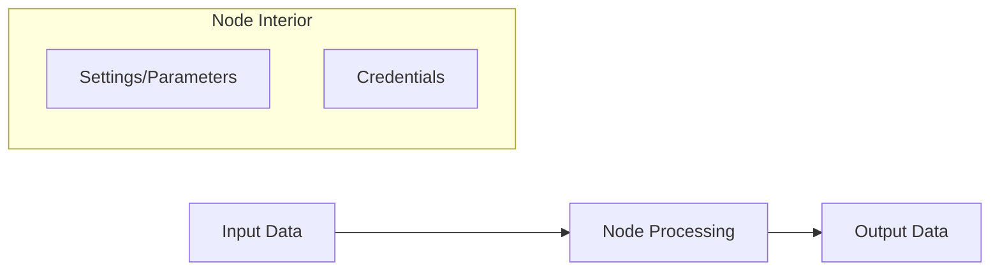

# Understanding Nodes in n8n

Nodes are the basic building blocks (the "atoms") of all n8n workflows. A workflow is built by connecting consecutive nodes together.

## Node Categories

Nodes are generally grouped into three main types:

1.  **Entry Points (Triggers):** What starts the workflow.
2.  **Functions:** Transform, filter, or format data.
3.  **Exit Points (Actions/Apps):** Connect to external services to send or update data.

---

## Adding Nodes to the Canvas

When you start on an empty canvas, you can add nodes in two ways:
- **Add First Step:** Usually prompts for a **Trigger** node.
- **Plus (+) Button:** Allows you to search for and add any node.
- **Connection Plus:** Clicking the `+` on an existing node's output automatically connects the new node.

---

## Node Settings & Configuration

Double-clicking a node opens its settings. There are two primary configuration views:

### 1. Parameters (Default)
Specific to the node and the selected **Operation**.
- **Operation:** The specific action the node will perform (e.g., `Append Row` vs `Get Rows` in Google Sheets).
- **Credentials:** Authentication settings for external apps. Saved at the instance level for security and efficiency.

### 2. Advanced Settings (Gear Icon)
Node-independent settings including:
- **Notes:** Add descriptions to your nodes for better workflow clarity.
- **Execution Settings:** i.e. `Retry on Fail`, `Execute Once`, and `Error Handling`.

---

## Data Visualization

Nodes display data in three main views to help you understand what's happening:

| View | Description |
| :--- | :--- |
| **Table View** | Displays data in a spreadsheet-like format (columns and rows). |
| **JSON View** | Shows the raw data as key-value pairs (the actual format n8n uses). |
| **Schema View** | Shows the structure of the keys and example values. |

### Data Flow Model

---

## Example: Google Sheets Node
- **Resource:** Sheet
- **Operation:** Get Rows
- **Authentication:** OAuth2 or Service Account.
- **Outcome:** The node reads the spreadsheet and outputs each row as a separate item for the next node to process.
